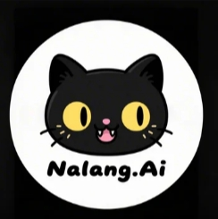

# Nalang.ai - AI Chat Interface

A modern, full-stack AI chat application built with Next.js 15, featuring real-time AI conversations, user authentication, and a beautiful UI powered by Nalang.ai.



## 🛠️ Tech Stack
- **Frontend**: Next.js 15, React 19, TypeScript
- **UI Components**: Radix UI, Tailwind CSS, Lucide React icons
- **Authentication**: Supabase Auth
- **Database**: Supabase (PostgreSQL)
- **AI Integration**: nalang API (SSE streaming)
- **Styling**: Tailwind CSS with custom animations
- **Forms**: React Hook Form with Zod validation
- **State Management**: React hooks and context

## 🚀 Getting Started

### Prerequisites

- Node.js 18+ 
- pnpm, npm, or yarn
- Supabase account
- nalang API key

### Installation

1. **Clone the repository**
   ```bash
   git clone <your-repo-url>
   cd nalangai
   ```

2. **Install dependencies**
   ```bash
   pnpm install
   # or
   npm install
   # or
   yarn install
   ```

3. **Set up environment variables**
   Create a `.env.local` file in the root directory:
   ```env
   NEXT_PUBLIC_SUPABASE_URL=your_supabase_project_url
   NEXT_PUBLIC_SUPABASE_ANON_KEY=your_supabase_anon_key
   SUPABASE_SERVICE_ROLE_KEY=your_supabase_service_role_key
   NALANG_API_KEY=your_nalang_api_key
   NALANG_MODEL=nalang-xl-10 # optional, defaults to nalang-xl-10
   ```

4. **Set up Supabase**
   - Create a new Supabase project
   - Set up the following tables in your database:
     - `users` (handled by Supabase Auth
     - `conversations` (id, title, user_id, created_at, updated_at)
     - `messages` (id, conversation_id, role, content, created_at)
   - Enable Row Level Security (RLS) policies

5. **Run the development server**
   ```bash
   pnpm dev
   # or
   npm run dev
   # or
   yarn dev
   ```

6. **Open your browser**
   Navigate to [http://localhost:3000](http://localhost:3000)

## 📁 Project Structure

```
nalangai/
├── app/                    # Next.js 13+ app directory
│   ├── api/               # API routes
│   │   ├── chat/          # Chat API endpoint
│   │   └── conversations/ # Conversation management API
│   ├── auth/              # Authentication pages
│   │   ├── login/         # Login page
│   │   ├── sign-up/       # Sign up page
│   │   └── error/         # Auth error handling
│   ├── chat/              # Main chat interface
│   ├── globals.css        # Global styles
│   ├── layout.tsx         # Root layout
│   └── page.tsx           # Home page
├── components/             # React components
│   ├── auth/              # Authentication components
│   ├── chat/              # Chat interface components
│   ├── ui/                # Reusable UI components
│   └── theme-provider.tsx # Theme context provider
├── hooks/                  # Custom React hooks
├── lib/                    # Utility libraries
│   ├── api.ts             # API client
│   ├── supabase/          # Supabase configuration
│   └── utils.ts           # Utility functions
├── public/                 # Static assets
├── styles/                 # Additional styles
└── scripts/                # Build and deployment scripts
```


## 🎨 Customization

### Themes
- Modify `components/theme-provider.tsx` to add custom themes
- Update `tailwind.config.js` for custom color schemes

### AI Models
- Change the nalang model via the `NALANG_MODEL` env or in `app/api/chat/route.ts`
- Add support for other AI providers (Anthropic, Google, etc.)

### UI Components
- Customize components in `components/ui/`
- Add new components following the existing pattern


## 📝 License

This project is licensed under the MIT License - see the [LICENSE](LICENSE) file for details.
